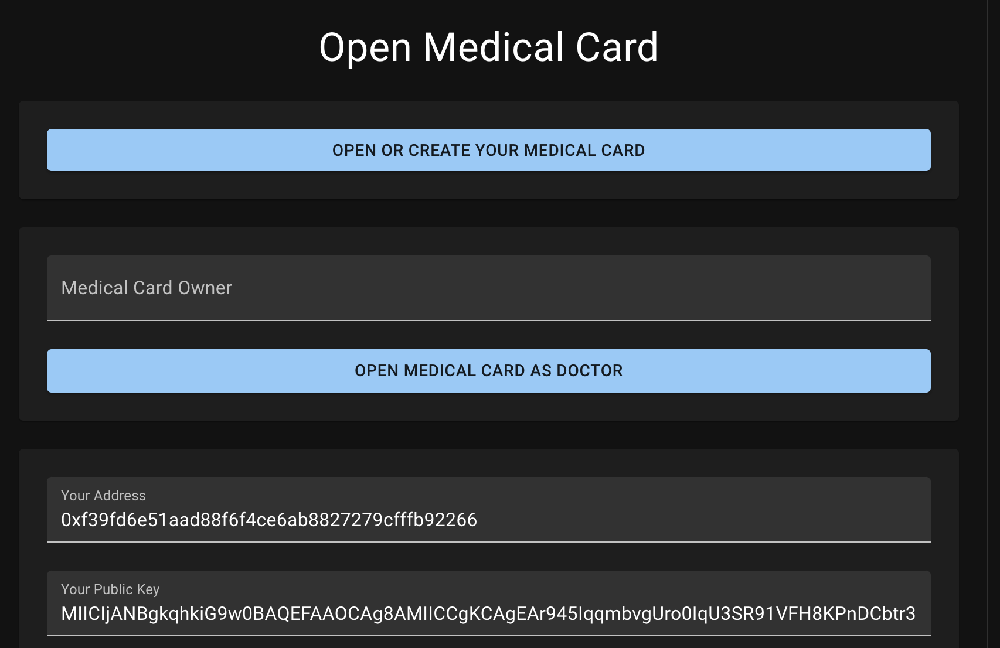
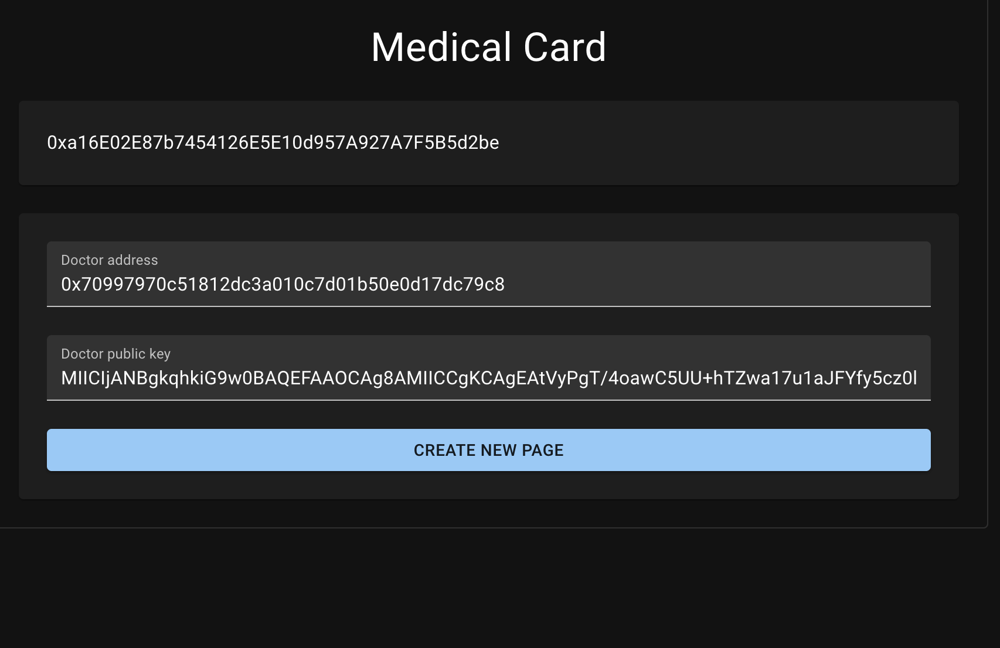
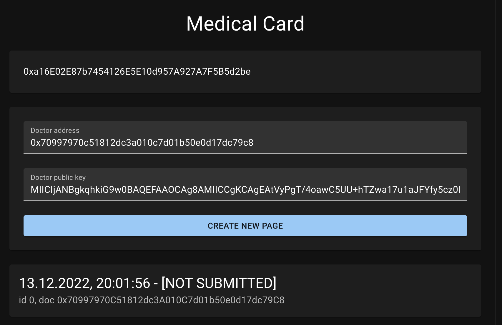
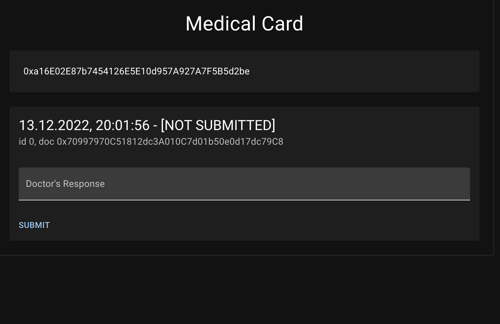
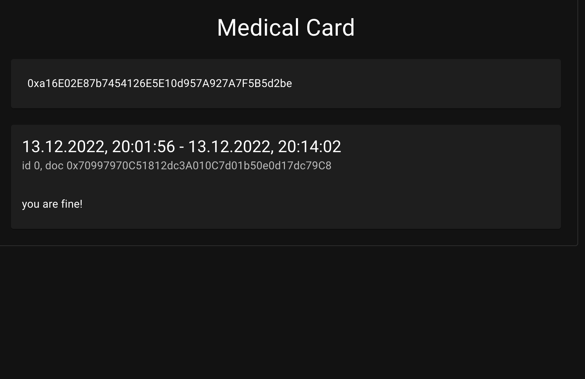
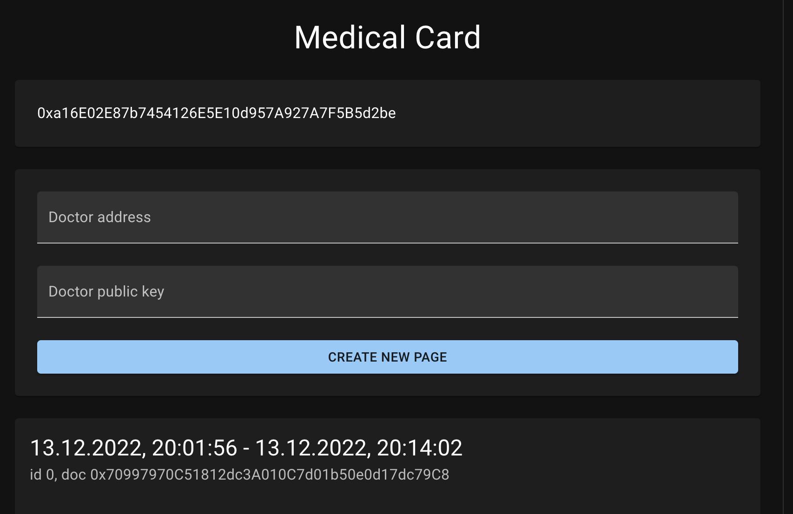

# MedicalCard project

URL of application: https://72f57a1a-a9be-4bf2-b053-42b3055d8832.website.yandexcloud.net/final/index.html

### Technological stack 

Solidity
React
IPFS

All files in ipfs are encrypted using symmetric encryption. 

In IPFS I store two kinds of files (json): request from patient and response from doctor. Patient's request can access the patients and doctor.
Doctors response can access thr patient and doctor. 

### Functionality

App has to roles: 

First role is the role of patient, patient can open or create medical card by clicking on upper button 

Second role is the role of doctor, doctor can open patient medical record, see the history of records and write the prescription

On photo, you can see the address of person and his public key, this public key is used to get the symmetric key, which is used to decrypt records. 

How application works: 

Patient profile 

The patient enters the app, clicks on `create or get medical record`, types the public address and data for encryption of doctor  who can access his record.
Basically at this step patient is giving to the specific doctor access to medical record.  

Patient clicks the `submit` button, by this he uploads the request file (which is json) to IPFS

`not submitted` means that doctor didn't open and make prescription yet. 

Lets switch to doctor's profile 

By clicking on `see as doctor` button and typing patients public address he open the medical record. 

After that he can write the perception and submit the record app. 

Now we can switch back to patient and check that record was signed by doctor. 

### For local testing I advise to use hardhat 

Zero step: deploy contract `contract.sol`, put the contact address to `src/web3/index.js`

Firstly, run the hardhat using `hardhat node`

Secondly, run the application using `react-scripts start`

Open [http://localhost:3000](http://localhost:3000) to view it in your browser.
